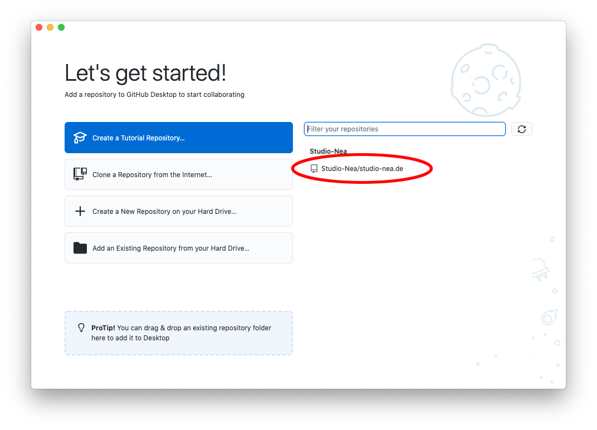
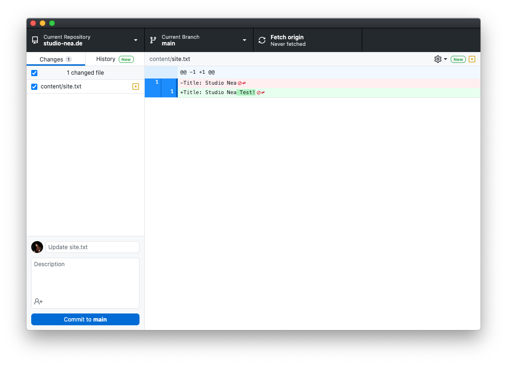
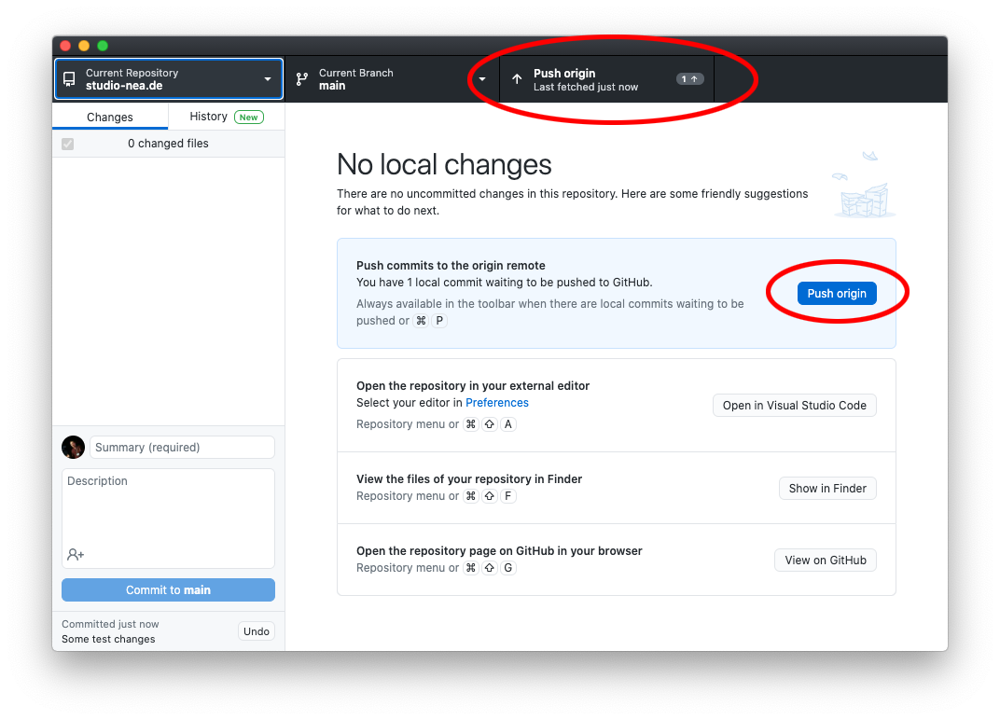

studio-nea.de
=============

# Workspace Setup

In order to modify files you can either use the GitHub UI directly or checkout a local copy of the source code. For that it is recommended to use their [desktop app](https://desktop.github.com/).

## Setup via Desktop App

First download the app from [their website](https://desktop.github.com/). Once installed please log-in. Make sure your account got invited to the [Studio-Nea](https://github.com/Studio-Nea?type=source) GitHub organisation and has access to this repository. You should see the repository being listed on the right side:

Select it and click on `Clone Studio-Nea/studio-nea.de`. A modal will ask you for the Local Path to clone the source code to. Pick a directory that works for you (ideally where you have setup MAMP or whatever PHP server you use for local development) and submit with clicking on `Clone`.

## Make Changes

You can now make changes to your local copy of the source code. After you are done you will see all changes in the GitHub app, e.g.:

Have a check if all these changes are correct and if so commit them. You can do this by adding a comment about what you changed in the input box at the bottom right (next to your profile icon). If you like to add a broader description, use the textarea to do so but it is not mandatory. Only writing a short commit message is required.

## Push Changes Upstream

After you are done, you can push changes upstream. For that click on the button in the main window or at the top of the app, e.g.:

That's it!

# Deployment

All changes to the `main` branch are automatically uploaded to the FTP server. No action required.
